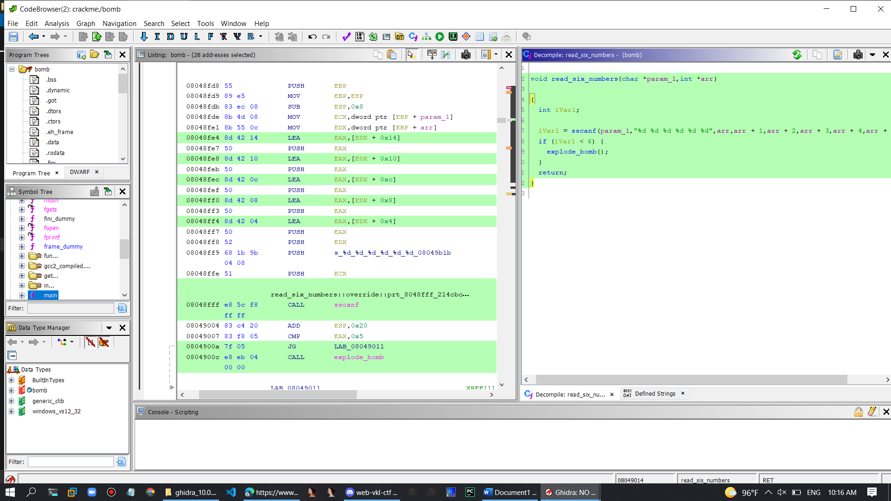

# ReCTF

Writeup for ReCTF

Challenge 1: x86

Phase 1:

Phase 1 \(x86\)

100

The CMU bomb lab is a famous reverse engineering challenge from CMU.

This category's challenges will track your progress through the 32-bit x86 CMU bomb lab.

Welcome to my fiendish little bomb. You have 6 phases with which to blow yourself up. Have a nice day!

Kiểm tra file nhị phân trên linux sử dụng IDA để phân tích tĩnh

Vào Hàm phase 1 xem thử có gì không.

Bởi vì ida không hiện mã giả được nên ta dùng ghidra xem thì sẽ thấy nó đưa một chuỗi gọi là Public speaking very esay

Mà hàm string\_not\_equal có nghĩa nó sẽ thực hiện nhiệm vụ so sánh chuỗi fake mình có bằng nó hay không nếu bằng nó sẽ không nổ quả bom còn ngược lại sẽ có

Flag : Public speaking very esay

Phase 2:

## Phase 2 \(x86\)

### 100

Phase 1 defused. How about the next one?

Tại vì một bài này có chung 7 thử thách chung một file nên mình sẽ bỏ qua các bước kiêm tra file và đến phân tích nó.

Ở đây sử dụng ghidra để phân tích mã rời rạc cho tiện.

Nếu bạn chưa biết cách sử dụng ghidra thì bạn xem tham khảo link này

[Ghidra quickstart & tutorial: Solving a simple crackme - YouTube](https://www.youtube.com/watch?v=fTGTnrgjuGA)

Vô phân tích hàm readsixnumber

Hàm này dùng để đọc 6 con số ta nhập vào nó như các mảng số nguyên của ta.

Phân tích sơ bộ thì nếu như vị trí thứ 1 của con số đó mà khác 1 thì sẽ nổ còn nếu một thì không sao. Tiếp tục xuống phía dưới

\(arr\[iVar1 + 1\] != \(iVar1 + 1\) \* arr\[iVar1\]\)

Ta để ý câu lệnh này là lấy giá trị của vi trí thứ 2 so sánh với chỉ số vi trí kế tiếp nhân với giá trị của hiện tại của số đó.

Ta có công thức tính toán như sau:

Số trước với vi trí + 1

Nếu ta nhập số 1 2 3 4 5 6 sẽ đúng 6 số.

Vì ta có số 1 ở vị trí đầu nên thõa mãn điều kiện đầu

Số thứ 2 : 2 \* 1 = 2

Số thứ 3: 2 \* 3 = 6

Số thứ 4: 6\* 4 = 24

Số thứ 5: 24 \* 5 = 120

Số thứ 6: 120 \* 6 = 720

Flag : 1 2 6 24 120 720

