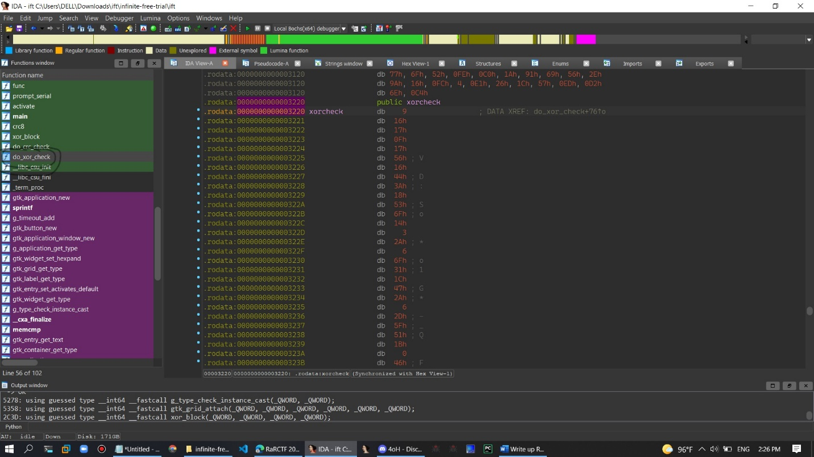

# RaRCTF

Write up RaRCTF

Thử thách verrybabyrev

100 point

Step 1:

Ta kiểm tra loại file thì đây là loại file ELF 64-bit LSB nó là file nhị phân

Step 2:

Load vào IDA để xem rõ mã máy của nó

lea rdi, format ; "Enter your flag: " // địa chỉ của chuỗi nhập vào

mov eax, 0

call \_printf // gọi hàm printf\(“Enter your flag”\)

mov rdx, cs:stdin@@GLIBC\_2\_2\_5 ; stream

lea rax, \[rbp+s\]

mov esi, 128 ; n

mov rdi, rax ; s

call \_fgets // fgets\(s,128,stdin\)

ta bắt đầu phân tích kĩ hơn và có được keygen

printf\(“Enter your flag”\)

fgets\(s,128,stdint\)

Tiếp theo ta xuống phái dưới

mov \[rbp+i\], 0 // I = 0

mov eax, \[rbp+i\] // eax = 0

cdqe

movzx eax, \[rbp+rax+s\] // tải 1 byte từ bộ nhớ s vào eax

cmp al, 72h ; 'r' // nếu ký khác ‘r’ sẽ nhảy xuống nope

jz short loc\_1303

code keygen lai

I = 0

If\( s\[0\] != ‘r’\) show nope

cmp \[rbp+i\], 126 /// 0 &lt; 126

jle short loc\_12D4

mov eax, \[rbp+i\]

cdqe

movzx edx, \[rbp+rax+s\] \] // tải 1 byte từ bộ nhớ s vào edx

mov eax, \[rbp+i\] // eax = i

add eax, 1 // i++

cdqe

movzx eax, \[rbp+rax+s\] // tải 1 byte từ bộ nhó s vào eax

xor edx, eax // edx ^= eax

mov eax, \[rbp+i\] // eax = i

cdqe

mov \[rbp+rax+s\], dl

add \[rbp+i\], 1 // i++

code keygen

while\(i &lt; 126\)

 s\[i\] ^= s\[i+1\]

 i++

sau cùng nó sẽ kiêm tra giá trị trả về vào memset đúng hay không.

Step 3:

Ta phát hiện trong bộ nhớ s có một sô byte.

Có lẽ ta sẽ đem theo tất cả byte này đi xor rồi in ra kết quả xem sao

byte\_xor **=** list**\(b"\x13\x13\x11\x17\x12\x1d\x48\x45\x45\x41\x0b\x26\x2c\x42\x5f\x09\x0b\x5f\x6c\x3d\x56\x56\x1b\x54\x5f\x41\x45\x29\x3c\x0b\x5c\x58\x00\x5f\x5d\x09\x54\x6c\x2a\x40\x06\x06\x6a\x27\x48\x42\x5f\x4b\x56\x42\x2d\x2c\x43\x5d\x5e\x6c\x2d\x41\x07\x47\x43\x5e\x31\x6b\x5a\x0a\x3b\x6e\x1c\x49\x54\x5e\x1a\x2b\x34\x05\x5e\x47\x28\x28\x1f\x11\x26\x3b\x07\x50\x04\x06\x04\x0d\x0b\x05\x03\x48\x77\x0a"\)**  
flag **= "r"** \# ky tu bat buoc trong dieu kien  
char **= "r"** \# su dung nay de dao chuoi lai  
**for** i **in** byte\_xor**:**  
 flag **+=** chr**\(**ord**\(**char**\)^**i**\)** \# dem y tu dao di xor voi cac byte trong danh sach  
 char **=** flag**\[-**1**\]** \# dao chuoi  
print**\(**flag**\)**

flag rarctf{3v3ry\_s1ngl3\_b4by-r3v\_ch4ll3ng3\_u535\_x0r-f0r\_s0m3\_r34s0n\_4nd\_1-d0nt\_kn0w\_why\_dc37158365}

Bài Dotty

**Dotty**

**clubby789**

**easy**

[Back to challenges](https://ctf.rars.win/campaign/rev)

150 points - First blood by eldstal, 191 solves in total - 97.4% positive votes

My new program will keep your secrets safe using military grade encryption!

[Dotty.exe - 81a733](https://files-ctf.rars.win/challenge-files/16/81a73332991e141a45c77a115a7c0415/Dotty.exe)

Bài này ta kiểm tra loại file Dotty.exe: PE32 executable \(console\) Intel 80386 Mono/.Net assembly, for MS Windows thì nó thuộc loại file được viết bằng app.net

Ta thử load vào tool dnspy xem

private static void Main\(string\[\] **args**\)  
        {  
            Console.Write\("Please enter your secret to encode: "\);  
            string phrase = Console.ReadLine\(\);  
            string text = Program.Dotter\(phrase\);  
            if \(text == Check.check\)  
            {  
                Console.WriteLine\("That's the right secret!"\);  
            }  
            else  
            {  
                Console.WriteLine\(text\);  
            }  
        }

Đây là là đoạn code c\# ta có thể hiểu là nó sẽ kiểm tra cái gì đó trong điều kiện check ta thử vào check xem sao

Nhìn sơ bộ đây là mã morse.

Ta có thể giải mã nó bằng trang dịch mã morse

-\|....\|.\|/\|..-.\|.-..\|.-\|--.\|/\|..\|...\|/\|---\|.---\|--.-\|-..-\|.\|-.--\|...--\|..-\|--\|--..\|.....\|.--\|..\|--\|.-..\|.\|.-..\|.....\|....-\|-\|.-\|.....\|-.-\|--...\|---\|.-\|--..\|-\|--.\|..---\|..---\|--...\|--.\|-...\|--..\|..-.\|-....\|-.\|.-..\|--.-\|.--.\|.\|--...\|-\|-....\|.--.\|--..\|--...\|.-..\|.....\|-\|--.\|-.-.\|-.\|-..\|-...\|--\|--\|...--\|-..\|.-\|-.\|.-..\|.....\|/\|-...\|.-\|...\|.\|...--\|..---

Đem nguyên đống này chuyển sang text bằng giải mã

T\|H\|E\|/\|F\|L\|A\|G\|/\|I\|S\|/\|O\|J\|Q\|X\|E\|Y\| 3\|U\|M\|Z\| 5\|W\|I\|M\|L\|E\|L\| 5\| 4\|T\|A\| 5\|K\| 7\|O\|A\|Z\|T\|G\| 2\| 2\| 7\|G\|B\|Z\|F\| 6\|N\|L\|Q\|P\|E\| 7\|T\| 6\|P\|Z\| 7\|L\| 5\|T\|G\|C\|N\|D\|B\|M\|M\| 3\|D\|A\|N\|L\| 5\|/\|B\|A\|S\|E\| 3\| 2

Flag nó là base 32 đem mã OJQXEY3UMZ5WIMLEL54TA5K7OAZTG227GBZF6NLQPE7T6PZ7L5TGCNDBMM3DANL5 BASE32

Ra flag : rarctf{d1d\_y0u\_p33k\_0r\_5py????\_fa4ac605}

Bài 3

Infinite Free Trial

medium

clubby789

Back to challenges

300 points - First blood by gedobbles, 67 solves in total - 86.5% positive votes

We've decided to make an app specially for flag hoarding, can you make sure no one can crack it?

NOTE: The flag is a valid registration key

Câu này ta kiểm tra là file nhị phân trên linux

Có cái nút register đăng ký nhìn có vẻ chả có gì khả quan cả

Ta đi vào ida để phân tích tĩnh

Để ý hàm xor check với cái chuỗi định dạng flag rarctf

Thử code ham đi xor bình thường trong chuỗi này xem ta được gì

import string

xor\_check = \[0x09, 0x16, 0x17, 0x0f, 0x17, 0x56, 0x16, 0x44, 0x3a, 0x18, 0x53, 0x6f, 0x14, 0x03, 0x2a, 0x06, 0x6f, 0x31, 0x1c, 0x47, 0x2a, 0x06, 0x2d, 0x5f, 0x51, 0x1b, 0x00, 0x46, 0x4a, 0x00, 0x04, 0x55, 0x66, 0x50, 0x01, 0x4c\]

flag = "rarctf"

for i in range\(len\(xor\_check\)\):

    for fc in string.printable:

        if ord\(flag\[i\]\) ^ ord\(fc\) == xor\_check\[i\]:

            flag += fc

print\(flag\)

Ra flag

rarctf{welc0m3\_t0\_y0ur\_new\_tr14l\_281099b9}

