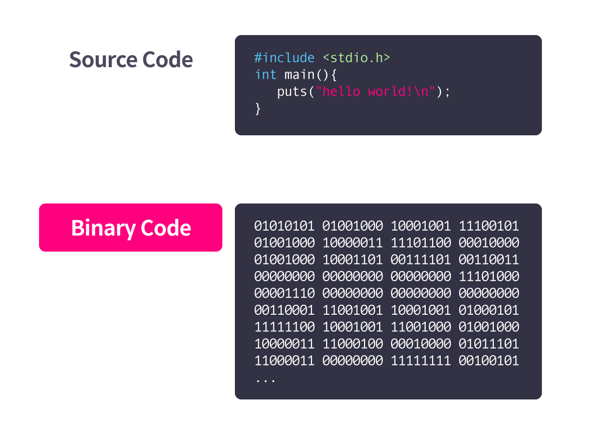

# Reverse Engineering

### 1. Reverse Engineering

Kỹ thuật đảo ngược đề cập đến một loạt các quy trình để tìm ra cấu trúc, chức năng và thiết kế của một đối tượng mục tiêu thông qua việc tháo rời hoặc phân tích một hệ thống hoặc thiết bị đã được tạo sẵn. Vì vậy, nó được sử dụng rộng rãi không chỉ trong phần mềm, mà còn trong kỹ thuật cơ khí, kỹ thuật điện tử, cũng như sinh học.

Nói một cách đơn giản, nó đề cập đến tất cả các giai đoạn 'tìm ra cấu trúc và quy trình hoạt động mà không có bản thiết kế thành phẩm'. Mặc dù đôi khi nó được gọi là 'thiết kế ngược' tùy thuộc vào tài liệu hoặc cuốn sách, trong tài liệu bài giảng này, 'thiết kế ngược' sẽ được rút gọn để thuận tiện và thuật ngữ 'đảo ngược' sẽ được thống nhất là thuật ngữ được sử dụng rộng rãi.


### ‘Software’ Reverse Engineering

Mặc dù đảo ngược có thể được áp dụng trong các ngành công nghiệp, tài liệu khóa học này nhằm nghiên cứu về đảo ngược trong phần mềm.

Nói cách khác, nó phân tích cấu trúc của phần mềm đích đã biên dịch trong trường hợp không có mã nguồn theo nhiều cách khác nhau, hiểu nguyên tắc hoạt động và cấu trúc bên trong dựa trên kết quả phân tích nhị phân bao gồm kết xuất bộ nhớ, và sau đó tìm ra nguồn gốc như thế nào. được viết dựa trên điều này. Nghiên cứu quy trình.


**Khi nào việc đảo ngược là cần thiết**

Nó phải là một kỹ thuật rất hiệu quả ở chỗ bạn có thể tìm hiểu về nguyên tắc hoạt động và cấu trúc của một đối tượng ngay cả khi không biết về đối tượng cần phân tích. Trên thực tế, đảo chiều được sử dụng rộng rãi trong nhiều lĩnh vực khác nhau.

### 2. Static Analysis vs Dynamic Analysis

Có hai phương pháp chính để tìm ra nguyên lý hoạt động của phần mềm đích thông qua việc đảo ngược.

Hai phương pháp này rơi vào phương pháp phân tích tĩnh, phân tích mà không chạy chương trình và phương pháp phân tích động, chạy chương trình và phân tích đầu vào / đầu ra và các bước hoạt động bên trong.

Phân tích tĩnh đòi hỏi sự hiểu biết về tất cả các thành phần tạo nên tệp thực thi, mã lắp ráp tương ứng với kiến ​​trúc CPU mà tệp thực thi đích sẽ thực sự chạy. Ngoài ra, để thực hiện phân tích động, cần phải xem quy trình hoạt động chi tiết cho từng bước thực thi, nên học kỹ thuật phân tích từng bước sử dụng trình gỡ rối phù hợp với môi trường.

Trong phần mới bắt đầu của chương trình học, bạn sẽ thực hành nghiên cứu và làm quen với cả hai kỹ thuật, áp dụng cả phương pháp phân tích tĩnh và động cho các chương trình rất đơn giản.


1. Cách mã được biên dịch

### Source Code → Binary Code


Cần phải biên dịch để chuyển đổi mã nguồn có thể đọc được của con người thành một chương trình có thể đọc được trên máy tính (sau đây được gọi là mã nhị phân).

Chương trình được sử dụng cho quá trình này được gọi là 'trình biên dịch'. Không phải tất cả các ngôn ngữ lập trình đều được biên dịch thành các mã nhị phân thực thi bằng trình biên dịch, nhưng thông thường chúng trải qua quá trình biên dịch để trở thành các mã nhị phân thực thi độc lập.

Trình biên dịch trải qua một số bước để chuyển đổi mã nguồn sang nhị phân.




Việc phân tích một nhị phân để xác định cách nó hoạt động và nói rộng ra, nó dựa trên mã nguồn nào, yêu cầu nhà phân tích đảo ngược quy trình của trình biên dịch.

Vì vậy, bằng cách chuyển đổi một mã nhị phân nhất định thành mã hợp ngữ và phân tích mã lắp ráp được chuyển đổi, bạn có thể thấy cách thức hoạt động của nhị phân đích. Quá trình chuyển đổi mã nhị phân thành mã lắp ráp được gọi là quá trình tháo rời.

Kỹ thuật đảo ngược phần mềm thường được gọi là 'đảo ngược', đặc biệt là phương pháp phân tích tĩnh, đề cập đến quá trình tìm ra cấu trúc của hành vi phần mềm bằng cách phân tích mã lắp ráp đã được tháo rời.


### **3/ **Instructions

#### Instructions(1/5) - Data Movement


Đầu tiên chúng ta hãy xem các hướng dẫn di chuyển một giá trị đến một địa chỉ thanh ghi hoặc bộ nhớ.


 **mov**

Lệnh di chuyển dữ liệu 


## Lea

Lệnh lấy địa chỉ 


Ví dụ dễ hiểu

```c
mov    dst,src       ; 
dst = srclea    dst,addr      ; 
dst = addr
```

rbx = 0x401A40

Vùng nhớ bên trái , bên phải giá trị thanh ghi


_0x401A40 = 0x12345678_

_\*_0x401A44 = 0xDEADBEEF

_\*0x401A48 = 0x00C0FFEE_

\*0x401A4C = 0x87654321

\*0x401A50 = 0x0BADBEEF


Ví dụ tiếp theo


## mov rax, \[rbx+8]  

thanh ghi rbx -> _0x401A48 di chyển giá trị 0x00C0FFEE vào rax_

__

## **lea rax, \[rbx+8]**

Thanh ghi rbx -> _0x401A48 lấy địa chỉa này vào rax _

## **Data Size**


Đơn vị kích thước của giá trị được sử dụng được gọi là WORD. Khi CPU 16-bit lần đầu tiên xuất hiện cách đây rất lâu, 16-bit, là đơn vị giá trị được CPU sử dụng vào thời điểm đó, được gọi là WORD và các thanh ghi đa năng có thể xử lý các đơn vị WORD được đặt tên là ax, cx , dx, bx. là nguồn gốc của tên thanh ghi. Khi thời gian trôi qua và kích thước của các thanh ghi tăng lên theo đơn vị 32 bit (mở rộng), tên của các thanh ghi trở thành eax, ecx, edx và ebx. Kể từ đó, tên thanh ghi được sử dụng trong CPU 64-bit giống như chúng ta đã nghiên cứu về thanh ghi trước đó.

****

**Link tham khảo các lệnh cờ nhảy**




****

__

__

__


****
