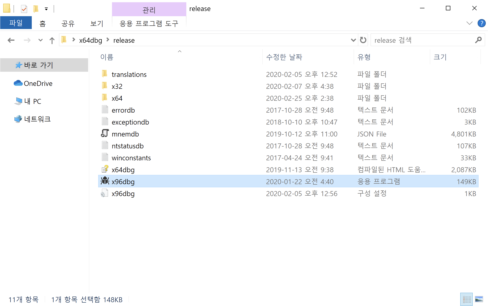
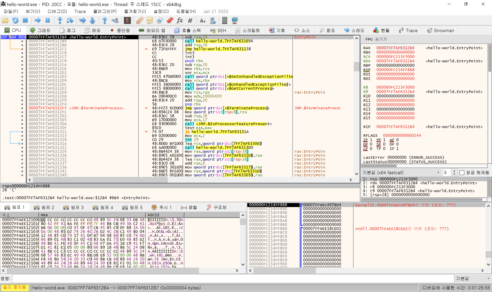
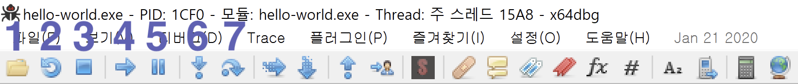
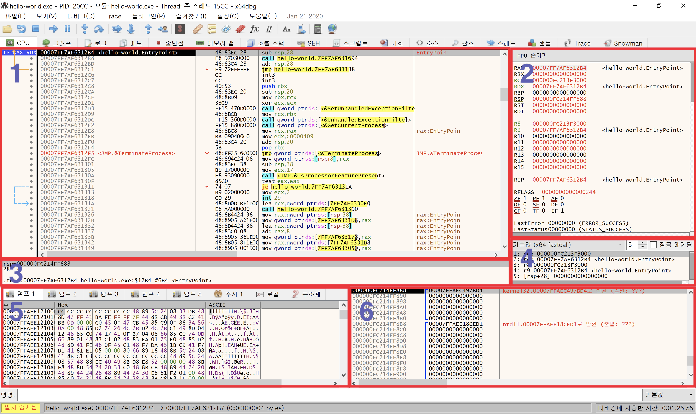
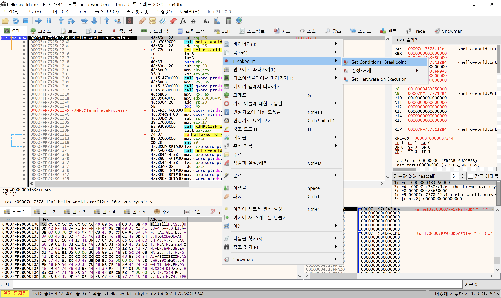
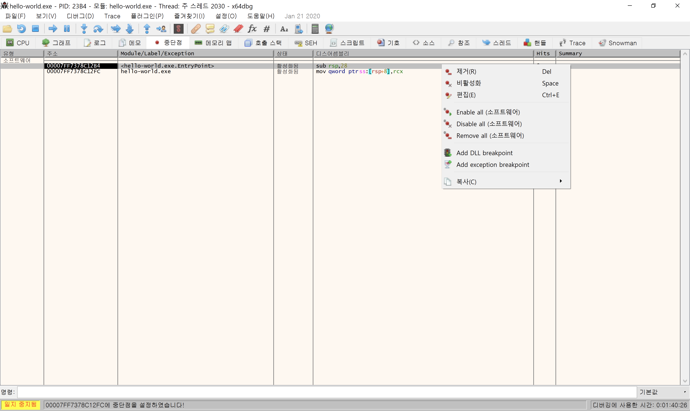

# x64 DBG

## Introduction

  **x64dbg** là giải pháp khử lỗi ứng dụng tích hợp nhiều tính năng hỗ trợ các nhà phát triển ứng dụng tối đa trong công việc viết và lập trình ứng dụng. Bên cạnh đó, phần mềm x64dbg còn có giao diện dễ sử dụng, cung cấp các tiện ích hỗ trợ, và cho phép người dùng cấu hình các thông số qua trình đơn Settings chuyên nghiệp.

```cpp
// hello-world.cpp

#include <stdio.h>

void main(){

    puts("hello world!\n");

}
```

Ta sẽ đảo ngược nó từ mã máy sang code 

Link tải phần mền debug : [https://x64dbg.com/\#start](https://x64dbg.com/#start)



Chọn vào x96 vào run.



giao diện x64dbg 

Cách sử dụng x64dbg - Giao diện người dùng cơ bản



1       Mở File chương trình cần phân tích

2      Reset lại chương trình

3      Ngừng chương trình 

4      Chạy tiếp chương trình

5      Tạm dừng chương trình. Nó được sử dụng khi bạn muốn tự ý dừng lại khi đang chạy.

6      Thực thi một dòng mã lắp ráp. Nếu bạn cố gắng thực hiện lệnh gọi, nó sẽ đi vào bên trong hàm      được gọi. \(Bước vào\)

7     Thực thi một dòng mã lắp ráp. Nếu bạn cố gắng thực hiện cuộc gọi, nó sẽ chạy cho đến khi hàm gọi thực hiện lệnh ret \(cho đến khi nó trả về\) và sau đó dừng lại. \(Bước qua\)


Một số giao diện chú ý 



Hình 1 Hiển thị ta thấy đươc vài mã lắp ráp bao gồm địa chỉ

Hình 2  Hiển thị các thanh ghi trong CPU

Hình 3 Phần này ta xem chi tiết trong Hình 1

Hình 4

 Nó hiển thị các giá trị rcx, rdx, r8, r9 trong số trạng thái thanh ghi hiện tại. Lý do tại sao nó được hiển thị riêng biệt với cửa sổ 2 là vì thứ tự thanh ghi là thứ tự đối số của quy ước gọi hàm được sử dụng theo mặc định trong hệ điều hành Windows 64-bit. Điều này cho phép bạn dễ dàng kiểm tra những giá trị nào được truyền dưới dạng đối số trong lệnh gọi.

Hình 5 

Hiển thị giá trị hex. Nó không tự động hiển thị theo quá trình thực thi của chương trình, và nếu bạn đưa ra lệnh để xem giá trị hex trong cửa sổ khác, nó sẽ được hiển thị trong cửa sổ này.

Hình 6

Hiển thị giá trị ngăn xếp. Theo mặc định, nó được hiển thị theo giá trị rsp. Đường màu xanh lam ở giữa thể hiện vùng ngăn xếp cho một chức năng. Tuy nhiên, nó đôi khi không chính xác vì x64dbg đoán và hiển thị nó thông qua phương pháp heuristic.


## Cách đặt break Point tại điểm bất kì để Debug phần mền



Ta click chuột phải và chọn Breakpoint or là ta có thể nhần f2 luôn tại chỉ ta đặt điểm dừng



Một số trường hợp khác ta có thể vào tab Breakpoint list và ta có thể tùy chọn như thêm xóa or thay đổi


## Note

Hình ảnh trên là bản x64dbg Hàn quốc nên các bạn có thể tìm đến link này để tìm hiểu thêm về cách dùng phần mền này

[https://error4hack.com/x64dbg-tutorial/](https://error4hack.com/x64dbg-tutorial/)


